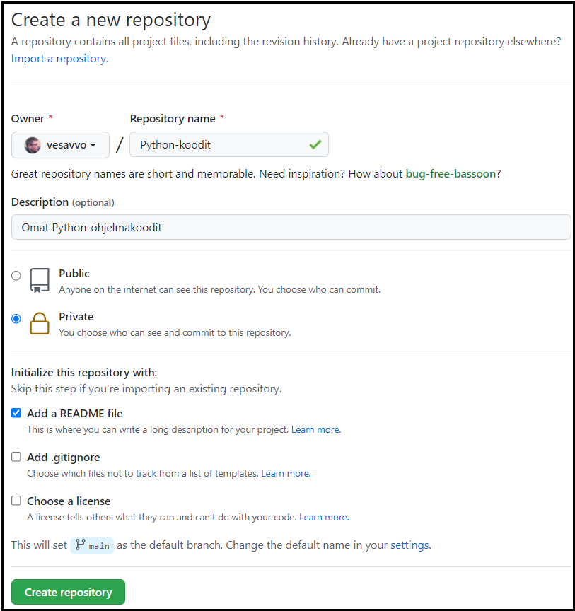
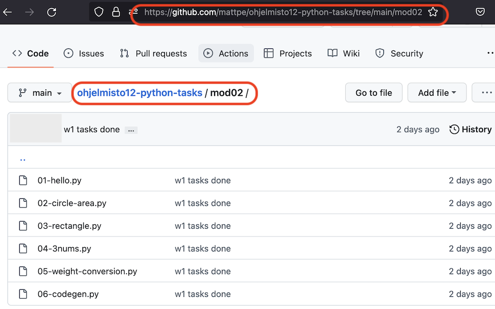
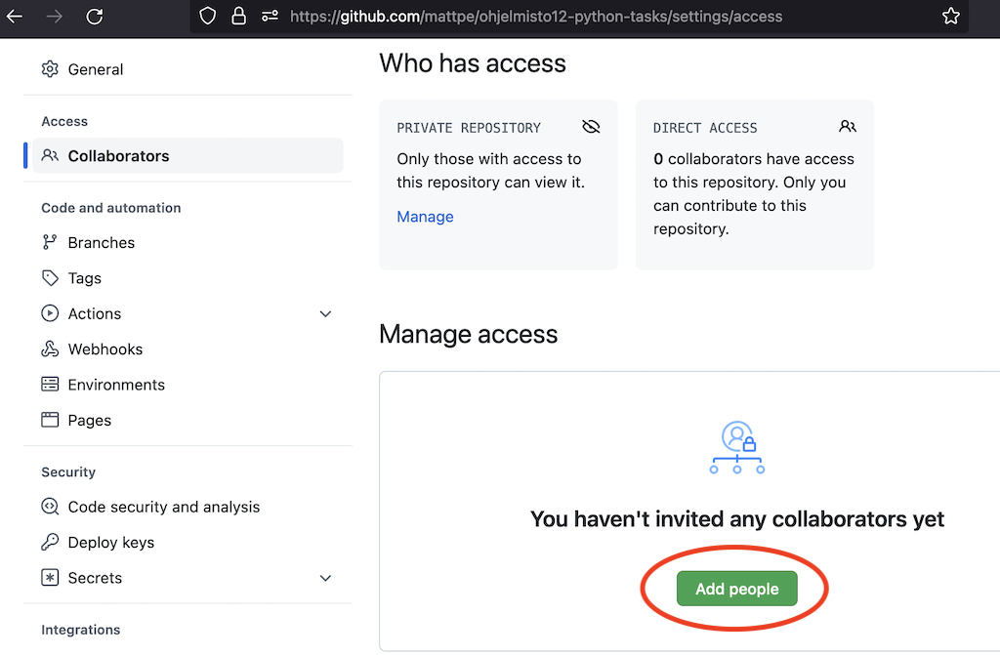

# Versionhallinnan käyttöönotto

Ohjelmistot rakentuvat vaihe vaiheelta ja pala palalta. Ohjelmistoja tehdään usein tiimityönä, ja tiimin jäsenten on päästävä käsiksi
samaan ohjelmakoodiin. Ohjelmakoodista syntyy kehitystyön aikana useita versioita, ja joskus on tarve palata aiempaan versioon. On myös
tärkeää varmistaa, että kerran kirjoitettu ohjelmakoodi ei vahingossa tuhoudu eikä katoa.

Tätä varten otetaan käyttöön versionhallinta.

## Git ja GitHub

Opintojaksolla (ja ammattimaisessa ohjelmistokehityksessä usein) käytetään Git-nimistä hajautettua versionhallintaa.
Hajautettu versionhallinta tarkoittaa sitä, että ohjelmakoodien yhteisestä tallennuspaikasta - eli repositoriosta - 
luodaan paikallisia kopioita versionhallinnan käyttäjien omille tietokoneille.
Ajantasaiset tiedot haetaan repositoriosta työskentelyn alkaessa (tästä käytetään termiä pull), ja tehdyt
muutokset päivitetään repositorioon (tätä kutsutaan termillä push).

GitHub on kaikkien saatavilla oleva verkkosivusto, johon Git-projektien ohjelmakoodit voidaan tallentaa.
Se on myös maailman suurin tähän tarkoitukseen kehitetty sivusto, ja käytännössä jokainen
ohjelmointialan ammattilainen käyttää tavalla tai toisella GitHubia.

Jotta voit käyttää GitHubia, rekisteröidy sen käyttäjäksi osoitteessa https://github.com/.

Kun olet luonut itsellesi käyttäjätilin GitHubiin, voit luoda sinne repositorioita eli tallennuspaikkoja
projekteille.

Voit luoda omille Python-koodeillesi repositorion kahdella tavalla: joko PyCharm-kehittimen kautta tai suoraan GitHubista.

## Repositorion luominen PyCharm-kehittimen kautta (suositeltava tapa)

Repositorion luominen olemassaolevan PyCharmilla tehdyn projektin kautta on suoriteltavaa, koska tällöin virtuaaliympäristön määritykset
voidaan tehdä helposti projektia luotaessa. Yhteys versionhallintaan määritetään näin:

1. Valitse GitHub-tili, jota käytät. Paina **Ctrl/Alt S** tai **CMD/,**. Valitse **Version Control / Github /Add**, ja syötä
GitHub-kirjautumistietosi.
2. Valitse PyCharm-kehittimessä 
**VCS / Share project on GitHub**. Rastita **Private**, jotta saat yksityisen repositorion.
3. Valitse repositorioon aluksi tulevat tiedostot. Voit lisätä tiedostoja myöhemmin.
4. Kun yhteys GitHub-repositorioon on muodostettu,
ilmestyy PyCharm-kehittimen valikkoriville uusi Git-valikko. Lisää haluamiasi tiedostoja toiminnolla **Git/Add**. PyCharm kysyy aina uutta tiedostoa luotaessa, liitetäänkö se repositorioon.

## Repositorion luominen GitHubissa (vaihtoehtoinen tapa)

Vaihtoehtoisesti voit luoda repositorion GitHub-sivustolla:

1. Rekisteröidy GitHubin käyttäjäksi osoitteessa https://github.com/.
2. Kirjauduttuasi sisään paina **Repositories**-otsikon vieressä olevaa **New**-painiketta.
3. Tee itsellesi oma yksityinen repositorio alla olevan kuvan mukaisesti.

Tämän jälkeen PyCharm-kehittimelle annetaan pääsy GitHubiin ja täsmennetään käytettävä repositorio:

1. Valitse GitHub-tili, jota käytät. Paina **Ctrl/Alt S** tai **CMD/,**. Valitse **Version Control / Github /Add**, ja syötä
GitHub-kirjautumistietosi.

2. Ota repositorio käyttöön Python-projektissasi. valitse PyCharm-kehittimessä **VCS / Get from
Version Control**, ja hae GitHubissa luomasi Git-repositorio napsauttamalla **Clone**. PyCharm luo uuden 
projektin, joka käyttää GitHub-reposiota.

Tässäkin tapauksessa PyCharm-kehittimen valikkoriville ilmestyy uusi Git-valikko.

## Repositorion käyttö

Tarkastellaan tässä vaiheessa GitHubin käyttöä yhden kehittäjän näkökulmasta. Tällöin voimme olettaa, että eri kehittäjät
eivät käytä samoja tiedostoja, ja tästä aiheutuvia samanaikaisen muokkauksen ongelmia ei esiinny. Oletamme myös, että
meille ei synny tarvetta jakaa kehitysprojektia eri kehityshaaroihin. GitHubin edistyneeseen
käyttöön kehitystiimin yhteistyöalustana
kannattaa perehtyä vasta myöhemmin projektityön alkaessa.

Työskentelyssä kannattaa ottaa tavaksi seuraavat käytännöt:

- Kun aloitat työskentelyn, anna komento **Git / Pull**. Komento hakee mahdolliset muuttuneet tiedot GitHub-palvelussa olevasta repositoriosta.
- Kun olet saanut uusia tuotoksia aikaan, sitouta muutokset komennon **Git / Commit** avulla. Muutosten pohjalta syntyy uusi tallennuspiste, johon on mahdollista myöhemmin palata, jos tarvetta ilmenee. Sitouta muutokset aina viimeistään siinä vaiheessa, kun olet lopettamassa työskentelyä. **Git / Add** toiminnolla voi valita tiedostoja mukaan seuraavaan tallennuspisteeseen (commit).
- Kun lopetat työskentelyn, anna komento **Git / Push**. Komento kopioi paikallisella koneessa olevat sitoutetut muutokset GitHub-palvelussa olevaan repositorioon.

Voit tutkia kehityshaaraa tallennuspisteineen GitHub-palvelussa.

Aina kun luot uuden tiedoston, PyCharm kysyy, otetaanko se mukaan versionhallintaan. Kaikki lähdekoodit, kuvat ja muut
arvokkaat tiedostot on syytä tallentaa GitHubiin. Toisaalta konfiguraatiotiedostot ja muu ajoympäristöön liittyvä
silppu kannattaa jättää versionhallinnan ulkopuolelle. Myöskään salasanoja sisältäviä tiedostoja ei tietoturvasyistä
tule tallentaa versionhallintaan.

## Tehtävien palautus GitHubin avulla

Palauta Omassa oleviin tehtäviin aina suoraan kyseisen moduulin tehtävien ratkaisuun osoittava linkki. Se onnistuu helpoiten niin, että navigoit selaimella GitHubissa oikeaan kansioon ja kopioit linkin suoraan selaimen osoiteriviltä. Nimeä python-tiedostosi ja kansiosi niin, että niistä voi päätellä suoraan, minkä tehtävien ratkaisut ne sisältävät.

Jotta opettajat näkevät tiedostosi GitHubissa, sinun pitää lisätä opettajien käyttäjätunnukset GitHub-projektiisi käyttäjiksi. Tämä tapahtuu _Settings_-välilehdeltä kohdasta _Collaborators_. Opettajien tunnukset kerrotaan Oma-työtilan kautta. Vaihtoehtoisesti voit määritellä projektisi näkyvyyden julkiseksi (public).

