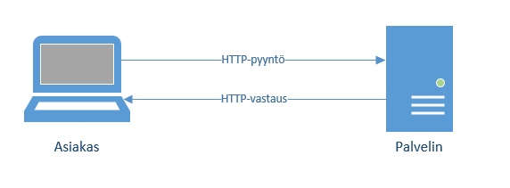

# Ulkoisen rajapinnan käyttö

Tässä moduulissa opit käyttämään ulkoisia ohjelmointirajapintoja, joiden avulla tietokoneet voivat
vaihtaa tietoja keskenään.

Internetin julkiset palveluntarjoajat kuten sääpalvelut ja avoimet tietokantapalvelut antavat mahdollisuuden
käyttää niitä ohjelmallisesti. Tuo ohjelmallinen käyttö tapahtuu niin kutsutun ohjelmointirajapinnan kautta.
Palveluntarjoaja päättää, millaisen ohjelmointirajapinnan se tarjoaa ja miten sitä käytetään. Rajapinnan
käyttö edellyttääkin aina rajapinnan dokumentaatioon perehtymistä.

## Tiedon siirto Internetissä

Tarkastellaan aluksi Internet-verkon toimintaa siitä näkökulmasta, miten verkkoon kytkettävät laitteet
kommunikoivat keskenään. Näin opimme ymmärtämään lähtökohdat laitteiden välisen kommunikaation toteuttamiseksi.

Tiedonsiirto Internetissä perustuu asiakas-palvelin-malliin. Palvelin tarkoittaa verkkoon kytkettyä tietokonetta,
joka odottaa siihen kohdistuvia yhteydenottoja. Käytännössä verkkoon kytketystä tietokoneesta tekee palvelinlaitteen se,
että tietokoneeseen  on asennettu palvelinohjelmisto, johon tuo yhteydenoton odottelu on ohjelmoitu.

Kun arkikielessä puhumme palvelimesta, voimme siis tarkoittaa sillä:

- verkkoon kytkettyä tietokonetta, joka toimii palvelinlaitteena, tai
- palvelinlaitteeseen asennettua palvelinohjelmistoa.

Asiakas-palvelin-mallin mukaisesti se laite, joka ottaa yhteyden palvelinkoneeseen (ja siinä olevaan palvelinlaitteeseen),
lähettää aluksi pyynnön (request). Palvelin käsittelee pyynnön ja tuottaa vastauksen (response):



Internetin verkkosivujen haku ja tarjoaminen nojaa asiakas-palvelinmalliin. Kun esimerkiksi kirjoitat selaimeen web-osoitteen (tai napsautat sivulla olevaa
linkkiä), lähtee pyyntö web-palvelimelle. Web-palvelin palauttaa vastauksena HTML-tiedoston, joka sisältää verkkosivun määrityksen.
Jos verkkosivu tarvitsee tuekseen kuvia, tyylimäärityksiä tai muita resursseja, lähtee jokaisesta uusi pyyntö web-palvelimelle,
ja pyydetyt resurssit saadaan vastauksena.

Vastaavalla tavalla voimme hakea paitsi verkkosivuja myös dataa. Voimme esimerkiksi kirjoittaa Python-ohjelman, joka hakee 
tämän päivän säätilan tai (kuten hetken päästä teemme) tietoa käyttäjän valitsemasta TV-sarjasta ulkopuoliselta palvelinkoneelta.
Tällöin oma Python-ohjelmamme lähettää pyynnön ulkopuoliselle palvelinkoneelle ja saa siihen vastauksen.

Palveluiden tarjoajat (kuten sääpalvelu tai TV-sarjojen hakupalvelu) tarjoavat niin kutsutuun palvelurajapinnan. Rajapinnan
kuvaus määrittää, minkälaisia pyyntöjä siihen voi lähettää ja missä muodossa vastaus saadaan.


## Pyynnön lähettäminen

Rajapintapyynnöt noudattavat HTTP-yhteyskäytäntöä. HTTP on asiakas-palvelinmalliin perustuva sopimus siitä, miten pyynnöt lähetetään
ja minkälaisina niihin saatavat vastaukset toimitetaan. HTTP-yhteyskäytäntö määrittelee kuvaannollisesti ilmaisten kirjekuoren, johon pyynnöt ja vastaukset
sujautetaan, jotta ne voidaan toimittaa Internetissä perille ja saada niihin vastaus: yhteyskäytäntö määrittää esimerkiksi,
että kukin vastaus koostuu otsikko-osasta ja rungosta ja että vastauksen mukana toimitetaan pyynnön onnistumista kuvaava
statuskoodi.

HTTP-yhteyskäytäntö määrittelee viisi pyynnöissä yleisesti käytettyä operaatiota:
- GET lukee sisältökohteen
- PUT korvaa olemassa olevan sisältökohteen
- POST luo uuden sisältökohteen
- PATCH muokkaa olemassa olevaa sisältökohdetta
- DELETE poistaa olemassa olevan sisältökohteen

GET-operaatio on sama operaatio, jota käytetään tavallisiin verkkosivujen hakupyyntöihin. Jos rajapinta suunnitellaan
niin kutsuttujen REST-suunnitteluperiaatteiden mukaisesti, on käytössä kaikki viisi operaatiota.
REST-rajapintamääritys noudattaa muitakin suunnitteluperiaatteita, joita ei tässä yhteydessä käsitellä. 

Toimiva rajapinnan
määritys voi perustua myös pelkkään GET-operaatioon, jolloin kyseessä ei ole varsinainen
REST-rajapinta. Tällä kurssilla tarkastellaan GET-operaatioihin perustuvan rajapinnan käyttöä ja toteutusta.

Tarkastellaan esimerkkinä TVmaze-palvelun tarjoaman rajapinnan käyttöä. Rajapinnan dokumentaatio
on saatavilla sivulla https://www.tvmaze.com/api.

Kyseessä on julkinen ja kaikille avoin rajapinta, joka ei edellytä käyttäjätunnusten luontia.
Tällaisiin rajapintoihin on yleensä mahdollista tehdä vain lukuoperaatioita. Lukuoperaatiot tehdään GET-rajapintapyyntöjen
avulla.

Tavoitteenamme on kirjoittaa Python-ohjelma, joka hakee kaikki ohjelmat, joissa esiintyy käyttäjän kirjoittama merkkijono.
TVmaze-rajapinnan dokumentaation perusteella tällainen rajapintapyyntö annetaan muodossa `URL: /search/shows?q=:query`, ja esimerkki
pyynnöstä on https://api.tvmaze.com/search/shows?q=girls.

Pyynnön toimivuutta kannattaa aluksi kokeilla kirjoittamatta se Internet-selaimen (esim. Chrome) osoiteriville.
Selaimen kautta voidaan yleensä lähettää vain  GET-pyyntöjä.

Python-kielisestä ohjelmasta vastaava pyyntö lähetetään `requests`-pakkauksen `get`-metodin avulla.
Vastaukseen kohdistettava `json`-metodi tuottaa
vastauksen sisällöstä Python-sanakirjarakenteen:

```python
import requests

hakusana = input("Anna hakusana: ")

# Pyynnön malli: https://api.tvmaze.com/search/shows?q=girls
pyyntö = "https://api.tvmaze.com/search/shows?q=" + hakusana
vastaus = requests.get(pyyntö).json()
print(vastaus)

```

Kokeillaan ohjelman toimintaa:
```monospace
Anna hakusana: python
[{'score': 0.6097852, 'show': {'id': 25376, 'url': 'https://www.tvmaze.com/shows/25376/python-hunters', 'name': 'Python Hunters', 'type': 'Reality', 'language': 'English', 'genres': ['Nature'], 'status': 'Ended', 'runtime': 60, 'averageRuntime': 60, 'premiered': '2010-07-12', 'ended': '2012-06-01', 'officialSite': None, 'schedule': {'time': '22:00', 'days': ['Monday']}, 'rating': {'average': None}, 'weight': 23, 'network': {'id': 42, 'name': 'National Geographic Channel', 'country': {'name': 'United States', 'code': 'US', 'timezone': 'America/New_York'}, 'officialSite': None}, 'webChannel': None, 'dvdCountry': None, 'externals': {'tvrage': None, 'thetvdb': 177341, 'imdb': 'tt1688573'}, 'image': {'medium': 'https://static.tvmaze.com/uploads/images/medium_portrait/363/909096.jpg', 'original': 'https://static.tvmaze.com/uploads/images/original_untouched/363/909096.jpg'}, 'summary': "<p>They have no natural predators; they eat four times as much as an alligator; and if they're not stopped, they could destroy one of America's most important ecosystems. Now an elite squad of three licensed hunters is fighting back. As they capture snakes, the <b>Python Hunters</b> look for clues to how the invaders came to be established in the Everglades. Popular perception is that the snakes are the progeny of family pets released into the wild by irresponsible owners no longer willing or able to care for them. The Python Hunters though consider a more likely explanation is an incident in 1992, when a greenhouse at the edge of the Everglades, housing over 900 Burmese Pythons, was destroyed by Hurricane Andrew.</p>", 'updated': 1633547701, '_links': {'self': {'href': 'https://api.tvmaze.com/shows/25376'}, 'previousepisode': {'href': 'https://api.tvmaze.com/episodes/1075377'}}}}, {'score': 0.47944784, 'show': {'id': 5068, 'url': 'https://www.tvmaze.com/shows/5068/monty-python-almost-the-truth', 'name': 'Monty Python: Almost the Truth', 'type': 'Documentary', 'language': 'English', 'genres': ['Comedy'], 'status': 'Ended', 'runtime': 60, 'averageRuntime': 60, 'premiered': '2009-10-18', 'ended': '2009-10-23', 'officialSite': None, 'schedule': {'time': '', 'days': ['Monday', 'Tuesday', 'Wednesday', 'Thursday', 'Friday', 'Saturday', 'Sunday']}, 'rating': {'average': None}, 'weight': 43, 'network': {'id': 37, 'name': 'BBC Two', 'country': {'name': 'United Kingdom', 'code': 'GB', 'timezone': 'Europe/London'}, 'officialSite': 'https://www.bbc.co.uk/bbctwo'}, 'webChannel': None, 'dvdCountry': None, 'externals': {'tvrage': None, 'thetvdb': 118861, 'imdb': 'tt1422182'}, 'image': {'medium': 'https://static.tvmaze.com/uploads/images/medium_portrait/21/54341.jpg', 'original': 'https://static.tvmaze.com/uploads/images/original_untouched/21/54341.jpg'}, 'summary': '<p>Legendary British comedy troupe Monty Python all gathered in front of the camera one last time in this original documentary series that retells the entire Python phenomenon start to finish.</p>', 'updated': 1642386299, '_links': {'self': {'href': 'https://api.tvmaze.com/shows/5068'}, 'previousepisode': {'href': 'https://api.tvmaze.com/episodes/315335'}}}}, {'score': 0.3801934, 'show': {'id': 41604, 'url': 'https://www.tvmaze.com/shows/41604/mytho', 'name': 'Mytho', 'type': 'Scripted', 'language': 'French', 'genres': ['Drama', 'Comedy'], 'status': 'Ended', 'runtime': 52, 'averageRuntime': 52, 'premiered': '2019-10-10', 'ended': '2021-09-30', 'officialSite': 'https://www.arte.tv/fr/videos/RC-021458/mytho/', 'schedule': {'time': '', 'days': []}, 'rating': {'average': None}, 'weight': 47, 'network': {'id': 414, 'name': 'ARTE', 'country': {'name': 'France', 'code': 'FR', 'timezone': 'Europe/Paris'}, 'officialSite': None}, 'webChannel': None, 'dvdCountry': None, 'externals': {'tvrage': None, 'thetvdb': 361569, 'imdb': 'tt10677432'}, 'image': {'medium': 'https://static.tvmaze.com/uploads/images/medium_portrait/265/662931.jpg', 'original': 'https://static.tvmaze.com/uploads/images/original_untouched/265/662931.jpg'}, 'summary': '<p>Devoted mother and wife, Elvira feels more and more invisible to her family. One day, she gives into temptation and becomes caught up in a dreadful web of lies in her quest for love and attention.</p>', 'updated': 1635887033, '_links': {'self': {'href': 'https://api.tvmaze.com/shows/41604'}, 'previousepisode': {'href': 'https://api.tvmaze.com/episodes/2204496'}}}}, {'score': 0.34326607, 'show': {'id': 694, 'url': 'https://www.tvmaze.com/shows/694/monty-pythons-flying-circus', 'name': "Monty Python's Flying Circus", 'type': 'Variety', 'language': 'English', 'genres': ['Comedy'], 'status': 'Ended', 'runtime': 30, 'averageRuntime': 30, 'premiered': '1969-10-05', 'ended': '1974-12-05', 'officialSite': None, 'schedule': {'time': '22:00', 'days': ['Thursday']}, 'rating': {'average': 8.4}, 'weight': 83, 'network': {'id': 12, 'name': 'BBC One', 'country': {'name': 'United Kingdom', 'code': 'GB', 'timezone': 'Europe/London'}, 'officialSite': 'https://www.bbc.co.uk/bbcone'}, 'webChannel': None, 'dvdCountry': None, 'externals': {'tvrage': 4522, 'thetvdb': 75853, 'imdb': 'tt0063929'}, 'image': {'medium': 'https://static.tvmaze.com/uploads/images/medium_portrait/5/14980.jpg', 'original': 'https://static.tvmaze.com/uploads/images/original_untouched/5/14980.jpg'}, 'summary': "<p>And now for something completely different: <b>Monty Python's Flying Circus</b> was simply the most influential comedy program television has ever seen. Five Englishmen, all working under the constraints of conventional TV shows such as The Frost Report (for which the five Englishmen wrote), gathered together with an expatriate American in the spring of 1969 to break the rules. The result, first airing on BBC-1 on October 5, 1969, has influenced countless future men and women in the media and comedy since.</p>", 'updated': 1627558818, '_links': {'self': {'href': 'https://api.tvmaze.com/shows/694'}, 'previousepisode': {'href': 'https://api.tvmaze.com/episodes/61242'}}}}, {'score': 0.31305113, 'show': {'id': 8595, 'url': 'https://www.tvmaze.com/shows/8595/peyton-place', 'name': 'Peyton Place', 'type': 'Scripted', 'language': 'English', 'genres': ['Drama'], 'status': 'Ended', 'runtime': 30, 'averageRuntime': 30, 'premiered': '1964-09-15', 'ended': '1969-06-02', 'officialSite': None, 'schedule': {'time': '21:30', 'days': ['Tuesday']}, 'rating': {'average': None}, 'weight': 32, 'network': {'id': 3, 'name': 'ABC', 'country': {'name': 'United States', 'code': 'US', 'timezone': 'America/New_York'}, 'officialSite': 'https://abc.com/'}, 'webChannel': None, 'dvdCountry': None, 'externals': {'tvrage': None, 'thetvdb': 77441, 'imdb': None}, 'image': {'medium': 'https://static.tvmaze.com/uploads/images/medium_portrait/30/76577.jpg', 'original': 'https://static.tvmaze.com/uploads/images/original_untouched/30/76577.jpg'}, 'summary': "<p><b>Peyton Place</b> was America's first truly successful primetime serial. The series was the brainchild of veteran producer Paul Monash. Impressed with the success of Britain's monster hit Coronation Street, Monash wanted to import that UK series; however, ABC executives felt that US audiences would not cotton to the thick British accents and kitchen-sink drama. Monash countered with a slightly revamped version of Peyton Place, which had been a wildly popular novel by Grace Metalious and subsequent Hollywood film starring Lana Turner and Diane Varsi. While the book and series centered on the pious, hypocritical behavior of New England residents, the TV series eschewed most of that lasciviousness and told the story of life in a small New England village. In many ways, the TV program resembled a dramatic version of The Andy Griffith Show, featuring a recurring cast of warm, sympathetic characters.</p>", 'updated': 1639006567, '_links': {'self': {'href': 'https://api.tvmaze.com/shows/8595'}, 'previousepisode': {'href': 'https://api.tvmaze.com/episodes/476232'}}}}, {'score': 0.3000992, 'show': {'id': 16441, 'url': 'https://www.tvmaze.com/shows/16441/patton-360', 'name': 'Patton 360', 'type': 'Documentary', 'language': 'English', 'genres': ['War', 'History'], 'status': 'Ended', 'runtime': 60, 'averageRuntime': 60, 'premiered': '2009-04-10', 'ended': '2009-06-28', 'officialSite': None, 'schedule': {'time': '21:00', 'days': ['Friday']}, 'rating': {'average': None}, 'weight': 27, 'network': {'id': 53, 'name': 'History', 'country': {'name': 'United States', 'code': 'US', 'timezone': 'America/New_York'}, 'officialSite': None}, 'webChannel': None, 'dvdCountry': None, 'externals': {'tvrage': None, 'thetvdb': 90061, 'imdb': 'tt1409728'}, 'image': {'medium': 'https://static.tvmaze.com/uploads/images/medium_portrait/54/137074.jpg', 'original': 'https://static.tvmaze.com/uploads/images/original_untouched/54/137074.jpg'}, 'summary': '<p>As the United States enters World War Two, General George S. Patton sees the opportunity to fulfill his destiny. This series illustrates his combat exploits. But at times it seems he faced greater challenges with his superiors and his off the field behavior than the potent German army.</p>', 'updated': 1644181315, '_links': {'self': {'href': 'https://api.tvmaze.com/shows/16441'}, 'previousepisode': {'href': 'https://api.tvmaze.com/episodes/752601'}}}}, {'score': 0.2963689, 'show': {'id': 19823, 'url': 'https://www.tvmaze.com/shows/19823/monty-pythons-personal-best', 'name': "Monty Python's Personal Best", 'type': 'Scripted', 'language': 'English', 'genres': ['Comedy'], 'status': 'Ended', 'runtime': 60, 'averageRuntime': 60, 'premiered': '2006-02-22', 'ended': '2006-03-08', 'officialSite': None, 'schedule': {'time': '', 'days': ['Wednesday']}, 'rating': {'average': None}, 'weight': 34, 'network': {'id': 85, 'name': 'PBS', 'country': {'name': 'United States', 'code': 'US', 'timezone': 'America/New_York'}, 'officialSite': None}, 'webChannel': None, 'dvdCountry': None, 'externals': {'tvrage': None, 'thetvdb': 279855, 'imdb': 'tt0795156'}, 'image': {'medium': 'https://static.tvmaze.com/uploads/images/medium_portrait/69/174945.jpg', 'original': 'https://static.tvmaze.com/uploads/images/original_untouched/69/174945.jpg'}, 'summary': "<p><b>Monty Python's Personal Best</b> is a miniseries of six one-hour specials, each showcasing the contributions of a particular Monty Python member. Produced by Python (Monty) Pictures Ltd., the series first aired on PBS stations 22 February 2006, though two episodes were initially released on Region 1 DVD in 2005; the remaining episodes were released in late February 2006. The five surviving members (Eric Idle, Terry Jones, Terry Gilliam, Michael Palin and John Cleese) were invited to select favourite sketches they wrote or starred in, from the Monty Python's Flying Circus TV series as well as the troupe's films. All five collaborated on the sixth episode, a tribute to deceased Python Graham Chapman.</p>", 'updated': 1642386138, '_links': {'self': {'href': 'https://api.tvmaze.com/shows/19823'}, 'previousepisode': {'href': 'https://api.tvmaze.com/episodes/886748'}}}}, {'score': 0.29189575, 'show': {'id': 34625, 'url': 'https://www.tvmaze.com/shows/34625/peyton-and-polizzis-restaurant-rescue', 'name': "Peyton and Polizzi's Restaurant Rescue", 'type': 'Documentary', 'language': 'English', 'genres': [], 'status': 'Ended', 'runtime': 60, 'averageRuntime': 60, 'premiered': '2018-02-07', 'ended': '2021-02-28', 'officialSite': 'http://www.channel5.com/show/peyton-and-polizzis-restaurant-rescue/', 'schedule': {'time': '21:00', 'days': ['Wednesday']}, 'rating': {'average': None}, 'weight': 60, 'network': {'id': 135, 'name': 'Channel 5', 'country': {'name': 'United Kingdom', 'code': 'GB', 'timezone': 'Europe/London'}, 'officialSite': 'https://www.channel5.com/'}, 'webChannel': None, 'dvdCountry': None, 'externals': {'tvrage': None, 'thetvdb': None, 'imdb': None}, 'image': {'medium': 'https://static.tvmaze.com/uploads/images/medium_portrait/145/362889.jpg', 'original': 'https://static.tvmaze.com/uploads/images/original_untouched/145/362889.jpg'}, 'summary': "<p><b>Peyton and Polizzi's Restaurant Rescue</b> puts Alex Polizzi in the path of people whose dream to run their own restaurant has turned into an inexplicable nightmare. With Oliver Peyton's help, she'll set out to see if she can change the fortunes of struggling restaurant businesses.</p><p>From staffing to menus, service and décor, Alex, with the help of Oliver, will be on a quest to transform four struggling restaurants into successful and profitable ventures. Alex will draw on her career in the hospitality business to offer critique, advice and guidance, all served up with a large helping of her famously efficient, no-nonsense attitude. She'll ask Oliver Peyton to marshal the kitchens and critique the food, all in a bid to get the businesses to run with military precision.</p>", 'updated': 1631493183, '_links': {'self': {'href': 'https://api.tvmaze.com/shows/34625'}, 'previousepisode': {'href': 'https://api.tvmaze.com/episodes/2169352'}}}}, {'score': 0.27176368, 'show': {'id': 17742, 'url': 'https://www.tvmaze.com/shows/17742/pablo-escobar-el-patron-del-mal', 'name': 'Pablo Escobar: El Patrón del Mal', 'type': 'Scripted', 'language': 'Spanish', 'genres': ['Drama'], 'status': 'Ended', 'runtime': None, 'averageRuntime': None, 'premiered': '2012-05-28', 'ended': '2012-11-19', 'officialSite': None, 'schedule': {'time': '', 'days': []}, 'rating': {'average': None}, 'weight': 75, 'network': {'id': 1002, 'name': 'Caracol Televisión', 'country': {'name': 'Colombia', 'code': 'CO', 'timezone': 'America/Bogota'}, 'officialSite': None}, 'webChannel': None, 'dvdCountry': None, 'externals': {'tvrage': None, 'thetvdb': 259730, 'imdb': 'tt2187850'}, 'image': {'medium': 'https://static.tvmaze.com/uploads/images/medium_portrait/59/149372.jpg', 'original': 'https://static.tvmaze.com/uploads/images/original_untouched/59/149372.jpg'}, 'summary': '<p><b>Pablo Escobar: El Patrón del Mal</b> (Pablo Escobar: The King of Evil) is a fictional series product of free adaptation of "The Parable of Paul," Alonso Salazar, press articles and publicly known facts of national life, the historical facts are surrounded by fictional characters and dialogue, allowing supply and re-documented situations.</p>', 'updated': 1501048034, '_links': {'self': {'href': 'https://api.tvmaze.com/shows/17742'}, 'previousepisode': {'href': 'https://api.tvmaze.com/episodes/809913'}}}}, {'score': 0.238284, 'show': {'id': 47970, 'url': 'https://www.tvmaze.com/shows/47970/segitseg-itthon-vagyok', 'name': 'Segítség! Itthon vagyok!', 'type': 'Scripted', 'language': 'Hungarian', 'genres': ['Comedy'], 'status': 'Ended', 'runtime': 45, 'averageRuntime': 35, 'premiered': '2020-04-19', 'ended': '2020-05-31', 'officialSite': 'https://rtl.hu/rtlklub/segitseg-itthon-vagyok', 'schedule': {'time': '19:15', 'days': ['Sunday']}, 'rating': {'average': None}, 'weight': 16, 'network': {'id': 426, 'name': 'RTL Klub', 'country': {'name': 'Hungary', 'code': 'HU', 'timezone': 'Europe/Budapest'}, 'officialSite': None}, 'webChannel': None, 'dvdCountry': None, 'externals': {'tvrage': None, 'thetvdb': 380392, 'imdb': 'tt12171868'}, 'image': None, 'summary': None, 'updated': 1594052520, '_links': {'self': {'href': 'https://api.tvmaze.com/shows/47970'}, 'previousepisode': {'href': 'https://api.tvmaze.com/episodes/1873329'}}}}]
```

Pyynnön lähetys onnistuu ja vastaus saadaan.
Rajapinta palauttaa vastauksen JSON-muodossa, joka saadaan muutettua Python-kielen sanakirjarakenteeksi
vastausolion perimällä `json`-metodilla. (JSON on JavaScript-kielen syntaksia noudattava siirtoformaattina
yleisesti käytetty esitysmuoto.
Käsitteellisesti se on erittäin lähellä Python-kielen sanakirjarakennetta.)

Sanakirjaksi muunnettua vastausta on vielä tutkittava ja käsiteltävä, jotta saamme siitä tulostettua halutut tiedot.

## Vastauksen käsittely

Edellä JSON-siirtoformaatista tuotettu sanakirjamuotoinen vastaus sijoitettiin muuttujaan nimeltä `vastaus`. Sen rakenteen hahmottamiseksi voidaan käyttää
funktiota `json.dumps`, joka muotoilee vastauksen paremmaksi. Kirjoitetaan tulostuslauseen tilalle:
```python
print(json.dumps(vastaus, indent=2))
```

Tätä varten ohjelman alkuun on lisättävä `import`-lause:
```python
import json
```

Nyt tuloksena oleva rakenne on helpompi hahmottaa. Se alkaa seuraavasti:

```json
[
  {
    "score": 0.6097852,
    "show": {
      "id": 25376,
      "url": "https://www.tvmaze.com/shows/25376/python-hunters",
      "name": "Python Hunters",
      "type": "Reality",
      "language": "English",
      "genres": [
        "Nature"
      ],
```

Nähdään, että tuloksena olevassa listassa on alkioina ohjelmia, joista jokainen esitetään
sanakirjarakenteena. Kukin sellainen sisältää avaimen `show`, jonka arvona on jälleen sanakirjarakenne.
Sisemmästä sanakirjarakenteesta löytyy avain `name`, ja sen arvona on ohjelman nimen sisältävä merkkijono.
Esimerkiksi tuloslistan `vastaus` ensimmäisen elokuvan nimeen voitaisiin näin ollen viitata ilmauksella
`vastaus[0][show][name]`.

Nyt voimme korvata ohjelmassa olevan tulostuslauseen `for`-toistorakenteella, joka tulostaa jokaisen löytyneen
ohjelman nimen:

```python
for a in vastaus:
    print(a["show"]["name"])
```

Tuloste alkaa seuraavasti:

```monospace
Python Hunters
Monty Python: Almost the Truth
Mytho
Monty Python's Flying Circus
```

## Virheenkäsittely

Edellä laadittu ulkoista rajapintaa käyttävä ohjelma toimii silloin, kun ulkoinen palvelu (tässä tapauksessa TV Maze)
on toiminnassa ja onnistuu suorittamaan vastaanottamansa pyynnön. Koska kyseessä on ulkoinen palvelu, emme voi
kuitenkaan vaikuttaa palvelun toimivuuteen. Lisätään ohjelmaan tarpeelliset virhetarkistukset, jotta voimme ohjelmoida
virhetilanteiden käsittelyn haluamallamme tavalla.

Virhetilanteiden käsittely perustuu tässä kahteen seikkaan:
1. Vastauksen mukana tulevaan HTTP-statuskoodiin, sekä
2. Python-ohjelmassa syntyvien poikkeusten käsittelyyn.

Kun ulkoinen palvelu on toiminnassa, se palauttaa vastauksen mukana HTTP-statuskoodin, joka on 200 silloin,
kun pyyntöön vastataan onnistuneesti. Epäonnistuneeseen pyyntöön vastataan virheen luonnetta mahdollisimman
hyvin kuvaavalla statuskoodilla.
Statuskoodien virallinen luettelo on World Wide Web Consortiumin (W3C) web-sivulla
https://www.w3.org/Protocols/rfc2616/rfc2616-sec10.html.
Vastauksen mukana tuleva statuskoodi voidaan lukea ohjelmallisesti `requests.get`-metodin palauttaman
vastauksen ominaisuudesta `status_code`. Tässä rajoitutaan testaamaan onko saatu statuskoodi 200, vai onko
se jotakin muuta.

Toisinaan voi syntyä tilanne, jossa ulkoiseen palveluun ei saada lainkaan yhteyttä, ja palvelu ei pääse
edes palauttamaan virheestä kertovaa statuskoodia. Tämä ilmenee siten, että Python-ohjelma
kaatuu ajonaikaiseen virhetilanteeseen. Tällöin syntyy niin kutsuttu ajonaikainen poikkeus. Python-kielessä
poikkeusten käsittely on mahdollista ohjelmoida itse, jolloin se, mitä poikkeuksen syntyessä tapahtuu,
on ohjelmoijan päätettävissä. Poikkeuksen käsittely toteutetaan `try/except`-rakenteella.

Lisätään ohjelmaan HTTP-statuskoodin 200 varmistus sekä poikkeuskäsittelyrutiini kaikille
`request`-kirjaston tuottamille poikkeuksille.

Jokainen Python-poikkeus on olio.
Erityisesti `requests`-kirjaston tuottamat poikkeukset ovat `RequestException`-luokasta periytyvien luokkien
ilmentymiä. Virhetarkistuksilla täydennetty ohjelma näyttää tältä:

```python
import json
import requests

hakusana = input("Anna hakusana: ")

# Pyynnön malli: https://api.tvmaze.com/search/shows?q=girls
pyyntö = "https://api.tvmaze.com/search/shows?q=" + hakusana

try:
    vastaus = requests.get(pyyntö)
    if vastaus.status_code==200:
        json_vastaus = vastaus.json()
        print(json.dumps(json_vastaus, indent=2))
        for a in json_vastaus:
            print(a["show"]["name"])
except requests.exceptions.RequestException as e:
    print ("Hakua ei voitu suorittaa.")
```

Kokeillaan mitä tapahtuu, kun haku epäonnistuu. Muutetaan pyyntö tahallaan virheelliseksi tekemällä
lyöntivirhe verkko-osoitteeseen. Maatunnuksena on nyt virheellisesti `cob` eikä `com`:

```python
pyyntö = "https://api.tvmaze.cob/search/shows?q=" + hakusana
```

Nyt ohjelma ei "kaadu" virhetilanteeseen, vaan se toimii siten kuin olemme ohjelmoineet:
```monospace
Anna hakusana: python
Hakua ei voitu suorittaa.
```

Lopuksi tietenkin korjaamme verkko-osoitteen oikeaksi. Poikkeuskäsittelyn ansiosta olemme nyt
varautuneet esimerkiksi tilanteisiin, joissa TV Maze on poissa käytöstä huoltokatkon vuoksi.
Hyvään ohjelmointitapaan kuuluu lisätä ohjelmaan tämän kaltaiset virhetarkistukset.

