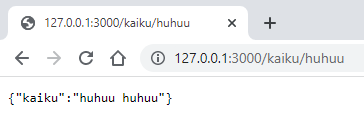

# Taustapalvelun ja rajapinnan rakentaminen

Tässä moduulissa opit toteuttamaan Python-kielisen taustapalvelun (*backend*). Tällöin voit rakentaa
web-palvelun siten, että web-sovelluksen HTML-/CSS-/JavaScript-käyttöliittymä kommunikoi
Python-kielisen taustapalvelun tarjoamien HTTP-päätepisteiden (*endpoint*) kanssa.

Taustapalvelun käyttäjän ei välttämättä tarvitse olla selain. Tässä opittavalla lähestymistavalla toteutettavaa
taustapalveua voi käyttää HTTP-yhteyskäytännön ansiosta ohjelmallisesti mistä tahansa palvelusta, millä tahansa ohjelmointikielellä.

## Flask-kirjaston asennus

Python-ohjelmasta rakennetaan taustapalvelu Flask-kirjaston avulla. Flask tarjoaa mahdollisuuden
päätepisteiden ohjelmointiin. Ulkoinen ohjelma (esimerkiksi verkkoselain) voi käyttää noita päätepisteitä
ja sitä kautta suorittaa taustapalveluun ohjelmoitua toiminnallisuutta.

Tarkastellaan esimerkkiä, jossa teemme taustapalvelun, joka laskee kaksi saamaansa lukua yhteen. Tällaiseen
laskentaan ei toki taustapalvelua tarvittaisi, mutta tarkoitus onkin havainnollistaa taustapalvelun toteuttamiseen
tarvittavia tekniikoita yksinkertaisen esimerkin kautta.

Aloitetaan Flask-kirjaston asentamisesta. Asennus on helppo tehdä suoraan PyCharm-kehittimestä:

1. Valitse **View / Tool Windows / Python Packages**.
2. Kirjoita hakukenttään **Flask**. Valitse avautuvasta listasta **Flask**-vaihtoehto ja napsauta **Install**.

Kirjasto on tämän jälkeen heti käytössä.

## Päätepisteen kirjoitus

Kun Flask on asennettu, voimme kirjoittaa ensimmäisen version ohjelmasta tiedostoon `summapalvelu.py`:

```python
from flask import Flask, request

app = Flask(__name__)
@app.route('/summa')
def summa():
    args = request.args
    luku1 = float(args.get("luku1"))
    luku2 = float(args.get("luku2"))
    summa = luku1+luku2
    return str(summa)

if __name__ == '__main__':
    app.run(use_reloader=True, host='127.0.0.1', port=3000)

```

Aloitetaan ohjelmaan perehtyminen sen viimeisestä rivistä. Sillä oleva `app.run`-metodin kutsu käynnistää taustapalvelun.
Palvelu avataan IP-osoitteessa 127.0.0.1, joka on omaa tietokonetta vastaava erikoisosoite. Tämä tarkoittaa, että
yhteys tuohon IP-osoitteeseen voidaan ottaa vain samasta tietokoneesta, jossa ohjelmaa ajetaan. Porttinumero 3000 kertoo,
että taustapalvelin odottaa mainittuja saman koneen yhteydenottoja tietoliikenneportin 3000 kautta. 

Ohjelman rivi `@app.route('summa')` määrittää niin kutsutun päätepisteen. Se kertoo, että seuraavan rivin funktio
nimeltä `summa` ajetaan silloin,
kun taustapalvelun käyttäjä lähettää pyynnön, jossa IP-osoiteosan jälkeen esiintyy merkkijono `/summa`.
Funktiota voidaan siis kutsua esimerkiksi selaimesta kirjoittamalla verkko-osoitteeksi `http://127.0.0.1:3000/summa`.
Teknisesti selain lähettää tällöin HTTP-yhteyskäytännön mukaisen GET-pyynnön, johon Flaskin avulla toteutettu
taustapalvelu vastaa.

Edellä kuvattu kutsu ei aivan riitä summan laskemiseen, sillä kutsun yhteydessä on myös määritettävä summan
yhteenlaskettavat. Ne voidaan välittää GET-pyynnön parametreina, jotka käsitellään `request`-kirjaston `args.get`-metodin
avulla.

Näin taustapalvelua voidaan kutsua kirjoittamalla selaimeen vaikkapa
osoite `http://127.0.0.1:3000/summa?luku1=13&luku2=28`.
Ensimmäinen parametri, eli liukuluvuksi muunnettu parametri "13" päätyy `luku1`-muuttujan arvoksi. Vastaavasti
toinen parametri, merkkijono "28" muutetaan liukuluvuksi ja annetaan muuttujan `luku2` arvoksi.
Summa lasketaan, ja se muunnetaan merkkijonoksi sekä palautetaan funktion paluuarvona.

Kun taustapalvelua kutsutaan selaimesta, vastauksena oleva luku nähdään selainikkunassa (kuvan porttinumero poikkeaa esimerkissä käytetystä):


Taustapalvelu toimii nyt teknisesti, mutta tulos ei vielä ole sellaisessa muodossa, että sen ohjelmallinen
käsittely olisi helppoa.

## JSON-vastauksen tuottaminen

Kun taustapalvelu palauttaa vastauksen selaimelle, halutaan vastaus antaa usein JSON-muodossa. JSON (*JavaScript
Object Notation*) on esitysmuoto, joka mukailee JavaScript-kielen oliorakennetta. Rakenne on onneksi intuitiivinen
myös Python-kielen olioihin tottuneelle kehittäjälle.

Muokataan esimerkin `summa`-funktiota siten, että se ei enää palauta merkkijonoa vaan tuottaa vastauksen JSON-muodossa.
Muodon tuottamiseen onnistuu suoraan Pythonin sanakirjarakenteesta:

```python
from flask import Flask, request

app = Flask(__name__)
@app.route('/summa')
def summa():
    args = request.args
    luku1 = float(args.get("luku1"))
    luku2 = float(args.get("luku2"))
    summa = luku1+luku2

    vastaus = {
        "luku1" : luku1,
        "luku2" : luku2,
        "summa" : summa
    }

    return vastaus

if __name__ == '__main__':
    app.run(use_reloader=True, host='127.0.0.1', port=3000)
```

Nyt ohjelma tuottaa JSON-vastauksen, jonka ohjelmallinen käsittely on helppoa vaikkapa selaimessa ajettavan
JavaScript-kielen avulla (kuvan porttinumero poikkeaa esimerkissä käytetystä):


Edellä kuvatun yksinkertaisen taustapalvelun idean pohjalta on mahdollista
rakentaa monipuolinen taustapalvelu, jossa on tarpeellinen määrä päätepisteitä.

## Pyynnön jäsentäminen

Edellä kuvatuissa esimerkeissä päätepisteeseen liittyvät parametriarvot annettiin HTTP-pyynnön parametreina, jotka eroteltiin
domain- ja maaosasta kysymysmerkillä (`?`). Tämä on perinteinen tapa välittää parametreja HTTP-pyynnön yhteydessä.

Vaihtoehtoinen tapa on kuvata pyynnön kohteena
oleva resurssi osana varsinaista verkko-osoitetta. Seuraava yksinkertainen esimerkki tuottaa "kaikupalvelun",
joka palauttaa annetun merkkijonon JSON-rakenteessa kaiutettuna eli kahdennettuna. Esimerkissä merkkijonoa ei anneta
parametrina vaan ikään kuin osana verkko-osoitetta. Flask tarjoaa suoraviivaisen tavan verkko-osoitteen osien
käsittelyyn:

```python
from flask import Flask

app = Flask(__name__)
@app.route('/kaiku/<teksti>')
def kaiku(teksti):
    vastaus = {
        "kaiku" : teksti + " " + teksti
    }
    return vastaus

if __name__ == '__main__':
    app.run(use_reloader=True, host='127.0.0.1', port=3000)
```

Selaimessa palvelu näyttäytyy näin:



Taustapalvelun ohjelmoija voi täysin päättää, miten verkko-osoitteena domain-osan ja maatunnuksen jälkeinen osa käsitellään.
Erityisesti REST-arkkitehtuurityylissä suositaan lähestymistapaa, jossa käsiteltävä resurssi kuvataan
viimeksi esitellyllä tavalla, osana verkko-osoitetta.
