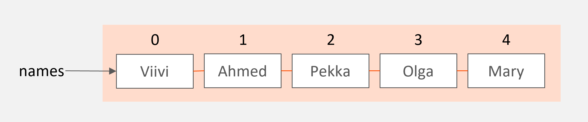

# List structures and iterative loop structures (for)

In this module you will learn how to use lists, the most important data structures of Python language. A list is 
an ordered group of items. With a list, you can store multiple values into a single list variable and loop through
the values using a for loop structure that has been developed for this purpose.

## List and list items

In programming a data structure is a structure where not just one but a whole group of values is stored into a single variable.
There are different types of data structures: list, dictionary, tree, stack and graph. Each data structure has their own
use range.

A list is a data structure where items are in a sort of and ordered queue. Items can be added to a specific position
of the list or removed. The items in a list can be iterated through. Most commonly new items are added to the end of a
list and items are removed from the beginning. Other practices are also possible.

Let's look at a program that creates a lists and sets its values to the names of five persons, or five strings:

```python
names = ["Viivi", "Ahmed", "Pekka", "Olga", "Mary"]
```

In the assignment statement where the list is created the name of the list is on the left side of the equal to sign.
A pair of square brackets is written on the right side. The list members are listed inside the square brackets separated
by commas.

In this case the result is a list with five string-type items. A list can be referenced with a list variable called `names`.
The following image illustrates the structure of a list:



Let's look at ways to reference list items. The following program prints out items and parts of a created list:

```python
names = ["Viivi", "Ahmed", "Pekka", "Olga", "Mary"]

print(names[3])
print(names[1])
print(names[-2])
print(names[1:3])
print(names[2:])
print(names)
```

The output is as follows:

```monospace
Olga
Ahmed
Olga
['Ahmed', 'Pekka']
['Pekka', 'Olga', 'Mary']
['Viivi', 'Ahmed', 'Pekka', 'Olga', 'Mary']
```

The first printing statement prints out the list item by index three. The items in a Python list can always
be referenced using their index. Index is the order number of a list item. Numbering always starts from zero,
so the item with index 3 is the fourth item in the list, in this case "Olga".

The second print is for the item at index 1. It it the second string in the list: "Ahmed".

The third printing statement uses a negative index. Negative index counts items from the end of the list in the reverse
order: notation -1 is the last item, -2 the second to last and so on. In this case "Olga" is printed as it is the
second to last item in the list.

The fourth printing statement prints out a portion of the list. The square brackets enclose an index range `1:3` which
means that the resulting new list has the items beginning from index 1 (including the starting point) up to index 3
(excluding the end point). The start index in the range is always included in the new list while the endpoint is not.
Therefore, the new list has items 1 and 2 or "Ahmed" and "Pekka". 

In the fifth print the endpoint has not been given. In this case items from the starting point up to the end of the
list are printed, including the last item. The resulting indices are 2, 3 and 4 and the corresponding strings "Pekka",
"Olga" and "Mary" are in the new list.

The last example statement prints out the whole list.

The length of a list can be retrieved using the Python built-in `len` function.

```python
print(len(names))
```

This outputs the length of the list, which is one larger than the index of the last item.
```monospace
5
```

## Index out of range

When referencing a list item by its index, it is possible to program an illegal reference that points
to an item that does not exist in the list. This type of an error is quite common in programming and 
it is good to learn how to recognize right from the start.

The following list has five items. The idea is to reference the fifth item in the list, but - as the indexing
starts from zero - the index 5 in the program actually refers to the sixth item. This results in an error:

```python
names = ["Viivi", "Ahmed", "Pekka", "Olga", "Mary"]
# Illegal reference
print(names[5])
```

A runtime exception occurs and a description of the error is printed on the console:
```monospace
Traceback (most recent call last):
  File "C:/Users/olliv/PycharmProjects/Python_Ohjelmistoteema/Esimerkit/listaesimerkki.py", line 4, in <module>
    print(names[5])
IndexError: list index out of range

Process finished with exit code 1
```

Once more the error message gives valuable information to the programmer: it show both the faulty statement as well as the
reason for the error: list index out of range.

## List operations

In the examples above, the list items were assigned to the list when the list was created after which the list remained
unchanged throughout the execution of the program. However, lists are often used dynamically by adding more items or removing
items while the program executes.

The following program first creates and empty list. Then the program asks the user to enter names until the user inputs
an empty string by just pressing Enter. Finally, the program prints out the entire list:

```python
names = []

name = input("Enter the first name or quit by pressing Enter: ")
while name!="":
    names.append(name)
    name = input("Enter the next name or quit by pressing Enter: ")

print(names)
```

An example on how the program works below:
```monospace
Enter the first name or quit by pressing Enter: Mikko
Enter the next name or quit by pressing Enter: Kerttu
Enter the next name or quit by pressing Enter: John
Enter the next name or quit by pressing Enter: Miriam
Enter the next name or quit by pressing Enter:
['Mikko', 'Kerttu', 'John', Miriam']
```

In the example, new items were added at the end of the list one by one using the `append` list operation. In Python
there are several ready made list operation for adding or removing items. The list items can also be sorted in
different ways using then operations.

The most common list operations are listed in the table below:

| Operation | Meaning                                                                                     | Example                                                           | 
|-----------|---------------------------------------------------------------------------------------------|-------------------------------------------------------------------|
| append    | adds an item to the end of the list                                                         | names.append("Matti")                                             |
| remove    | removes the first occurance of an item in the list                                          | names.remove("Pekka")                                             |
| insert    | inserts an item into a defined position in the list, index specified in the first argument  | names.insert(4, "Teppo")                                          |
| extend    | adds the items in the second list to the first list                                         | otherNames = ["Allu","Ninni"]<br/>names.insert(otherNames)        |
| index     | returns the index of the first occurence of the specified item                              | what_index = names.index("Olga")                                  |
| in        | checks if an item exists in the list                                                        | if "Matti" in names:<br/>&nbsp;&nbsp;&nbsp;&nbsp;"Matti found"    |
| sort      | sorts the list items in alphabetical or numerical order                                     | numbers.sort()                                                      |

## Going through a list using a for loop

The program above asked the user for names and then printed the entire list of names.

Next we will look at how to go through the list items one by one. Let's extend the program so that
it separately greets each person added to the list. The program is written as follows:

```python
names = []

name = input("Enter the first name or quit by pressing Enter: ")
while name!="":
    names.append(name)
    name = input("Enter the next name or quit by pressing Enter: ")

for n in names:
    print(f"Hello, {n}!")
```

The program works as follows:
```monospace
Enter the first name or quit by pressing Enter: Stefan
Enter the next name or quit by pressing Enter: Ville
Enter the next name or quit by pressing Enter: Aamu
Enter the next name or quit by pressing Enter:
Moi, Stefan!
Moi, Ville!
Moi, Aamu!
```

Accessing the list items one by one was implemented using a `for` loop:
```python
for n in names:
    print(f"Hello, {n}!")
```

These repetitive strucutres are great for looping through a list. The loop variable is assigned the value of each list
item one by one. The operation continues as long as there are items left.

The operation of going through each item in a list is called iteration.

## Range function

Besides iterating through a list, `for` loops have other uses as well. The structure can be used to easily create
a loop variable that is assigned to any required values as a sequence with one or more steps between the numbers.

- range(1,4) defines values 1, 2, 3
- range(5,0,-1) defines values 5, 4, 3, 2, 1
- range(10,21,2) defines values 10, 12, 14, 16, 18, 20

The first argument of the `range` fucntion is the starting point, the second argument the end point and the third, optional
argument defines the step size between numbers. If the step size is not defined, the default step is 1. If the step is defined
as 0, an error message is printed. 

If the `range` function is only given one argument, it is interpreted as the endpoint of the range. In this case the starting
point is zero and step is one.

The `range` function generates a Python range with specific values. A range can be looped through the same way as a list
structure.

For example, the following program outputs all numbers divisible by 3 between numbers 3 and 30. Notice that the start point
in the function call is included in the range while the endpoint is excluded. For this reason the endpoint must be set to
a number a bit larger than 30.

```python
for number in range(3,31,3):
    print(number)
```

Program output:

```monospace
3
6
9
12
15
18
21
24
27
30
```

Using the `range` function is a handy way of replacing a loop that uses a loop variable. The following
program prints string "Hello!" six times:

```python
for luku in range(6):
    print("Hello!")
```
