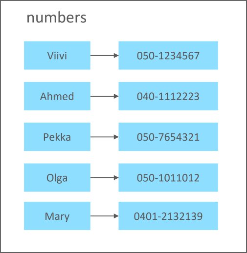

# Tuple, set, and dictionary

Earlier we discussed the Python list structure that is the most common data structure of Python.
Python language also offers three more builtin data structures that each have their own areas of use.

In this module you will learn to use these three Python data structures: tuple, set and dictionary.

## Tuple

Similar to a Python list, a tuple is used to present an ordered list of items. On the contrary,
a tuple is immutable: items cannot be added or removed after the tuple has been created.

Tuples are useful in situations where the queue of items is static: it is known that the items will not be
changed during the execution of the program. The advantages of using tuples over lists relate to memory management:
when a tuple is created, it can be reserved a fixed location in memory, and the address of a single item can
be calculated directly based on the beginning address and index. With lists this is not possible: when searching
for an item based on index, the running environment usually has to iterate through all the items in the list. 
This causes a speed difference: finding an item based on its index is faster in tuples. In practice, the difference
is unnoticeable when the data structure is small.

Let's look at an example of using a tuple. The following program creates a tuple of the names of the days of the week.
The program asks the user the number of the day and prints out the corresponding name. Notice that the indexing of a
tuple starts from zero the same way as with lists:

```python
days_of_the_week = ("Monday", "Tuesday", "Wednesday", "Thursday", "Friday", "Saturday", "Sunday")
day_number = int(input("Enter the day number (1-7): "))
day = days_of_the_week[day_number-1]
print(f"Day number {day_number} is {day}.")
```

When executed, the program works as follows:

```monospace
Enter the day number (1-7): 3
Day number 3 is Wednesday.
```

In the previous example, the elements inside the tuple are written between parentheses.
In many cases, these parentheses can be omitted. The following
program creates a tuple of three strings, and outputs its contents:

```python
fruits = "Orange", "Banana", "Apple"
print(fruits)
```

The output is:
```monospace
('Orange', 'Banana', 'Apple')
```

If data structures are nested, the use of parentheses may become necessary to avoid
ambiguity. For example,
in statement `values = 1, (2, 3), 4` the parentheses indicate that numbers 2 and 3 constitute
a tuple that is, in turn, inside a tuple.

Even though the use of parentheses around a tuple is not mandatory in most cases, many Python
developers consider it a good practice that improves code readability.

### Tuple unpacking

The elements inside a tuple can be unpacked into variables in the following way:
```python
fruits = "Orange", "Banana", "Apple"
(first, second, third) = fruits
print (f"The fruits are: {first}, {second} and {third}.")
```

This program makes the following output:
```monospace
The fruits are: Orange, Banana and Apple.
```

### Tuples as return values

Earlier on the course we learned about functions that are callable subroutines.
Tuples provide an easy way to circumvent the limitation that a function can have only one return
value. If the developer wants to return, for example, two values, he/she can create a
tuple that holds both values and return that tuple as the return value. From a technical
point of view, there's still one return value, but it is a tuple that can in turn contain
more than one value.

The following example illustrates the use of a tuple as a return value. The program contains
a die-casting function for the Monopoly board game. In Monopoly, one always casts two dice at a time.

```python
import random

def cast():
    first, second = random.randint(1,6), random.randint(1,6)
    return first, second

die1, die2 = cast()
print(f"The dice show {die1} and {die2}.")
```

The output reveals that we get a result for both casts with a single function call:
```monospace
The dice show 2 and 4.
```


## Set

Set is an unordered data structure, meaning that the items can occur in any order. As the items of a set are not
ordered, they cannot be referenced with an index. On the contrary to lists and tuples, the same item can occur
in a set only once, meaning that a set cannot have two identical items.

Let's look at the following example:

```python
games = {"Monopoly", "Chess", "Cluedo"}
print(games)

games.add("Dominion")
print(games)

games.remove("Chess")
print(games)

games.add("Cluedo")
print(games)

for g in games:
    print(g)
```

The program produces the following output:
```monospace
{'Chess', 'Monopoly', 'Cluedo'}
{'Chess', 'Monopoly', 'Dominion', 'Cluedo'}
{'Monopoly', 'Dominion', 'Cluedo'}
{'Monopoly', 'Dominion', 'Cluedo'}
Cluedo
Dominion
Monopoly
```

First, we create a set with three games: Monopoly, Chess and Cluedo. Then the set containing the games is printed out.
Notice that the games in the output are in different order than when the set was created. The printing statement 
concretizes the fact that the order of the items is not defined: the programmer must prepare for the fact that the
items can be printed out in any order. The order of presentation is determined by the internal storage solution and
may differ even when the same program is run again.

Next a fourth item, Dominion, is added to the three-item set of games. New items can be added with the `add` operation.
The print statement shows again that the order of the items is random.

Then one of the items, Chess, is removed from the set. This is done using the `remove` operation.

The items left are Dominion, Cluedo and Monopoly. Next, we are trying to add a new item which the same as one
of the existing items in the set: Cluedo. The `add` method does not raise an error but from the output we can
see that the same game has not been added again. This is an essential characteristic of a set: the same item
can be included only once.

Lastly, the items in the set are iterated through one by one. This is done with a similar `for/in` structure
that was used with lists. The resulting order can again be any possible order from the programmer's point of view.

In the previous example all of the items in the set were strings, so they were all of the same type.
However, there is no requirement for the items to be the same type. As an example, it is possible to create a set
where one of the items is an integer, the second one a string and the third one a list.

Finally, let's see how an empty set is constructed.
An empty set is created and initialized with the `set` function.
Thus, it is not possible to construct an empty set by simply adding 'empty' braces to
the source code in this manner: `names = {}`.
The following program correctly creates an empty set, adds one element into it, and outputs
the set's contents with a `print` statement:

```python
names = set()
names.add("Mary")
print(names)
```
The program produces the following output:
```monospace
{'Mary'}
```


## Dictionary

Dictionary is one of the most commonly used Python data structures.

A dictionary can store key-value pairs. A key is a sort of a handle that can be pulled to find the 
correct record in the dictionary to access its value.

Sometimes dictionary is called an associative table or a hash structure.

The following image represents the structure of a dictionary:



A dictionary called `numbers` contains the phone numbers of five persons. The name of a person is used as the key:
when you know the name, you retrieve the value - in this case, phone number.

Let's create a similar structure using Python. First, we will create a dictionary with the information of three persons.
After the dictionary is created, we will add two more persons and print out the dictionary, now including the names
and numbers of five persons. Lastly, we will ask the user for a person's name and print out the corresponding number if
the provided name is included in the keys of the dictionary.

```python
numbers = {"Viivi":"050-1234567",
           "Ahmed":"040-1112223",
           "Pekka":"050-7654321"}

numbers["Olga"] = "050-1011012"
numbers["Mary"] = "0401-2132139"

print(numbers)

name = input("Enter name: ")
if name in numbers:
    print (f"{name}'s phone number is {numbers[name]}.")
```

The program produces the following output:
```monospace
{'Viivi': '050-1234567', 'Ahmed': '040-1112223', 'Pekka': '050-7654321', 'Olga': '050-1011012', 'Mary': '0401-2132139'}
Enter name: Viivi
Viivi's phone number is 050-1234567.
```

When a dictionary is initialized by listing the values, each key-value pair is written as follows: `key : value`. Subsequent
key-value pairs are separated with commas.

A new value can be added to an existing dictionary using the `dictionary[key] = value` notation where `dictionary` is
the name of the variable that refers to the dictionary. Respectively, the value of an item in the dictionary can be
retrieved with `dictionary[key]`.

When iterating through a dictionary using the `for/in` structure, on each loop the value of the loop variable to refers
to the correponding key.

But are the items in a dictionary, or the key-value pairs - ordered? This depends on the Python version: starting from
version 3.7 the items are ordered, meaning that the running environment makes sure that the order of iteration is always the
same as the order in which the items were added to the dictionary. This is not guaranteed in older Python versions.
