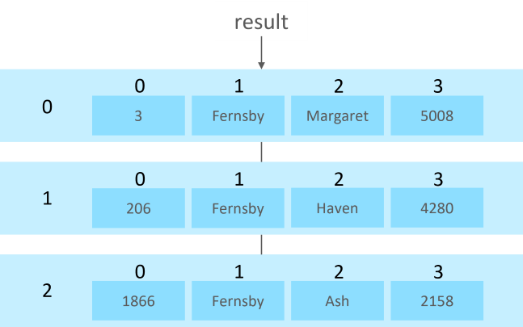

# Using relational databases

In this module you will learn how to use a relational database in a Python program.

Before you start, you should already have mastered the basic concepts of relational databases (tables, fields, records,
primary and foreign keys, datatypes). You should also be able to express database queries and data transformation
operations using the SQL language. Furthermore, you need to be able to design a small database structure and set up
a database on a database server.

This module uses the MariaDB database. However, the process is similar when using other databases.

# Database drivers

To use a relational database with your own program requires you to install a database driver.

On this course we are using Python programming language and MariaDB database manager. The required database
driver is a software between MariaDB and your own Python program that enables communication between the
two programs.

The database driver is needed already when establishing a connection to the database. Once the connection has been
established, the driver allows for SQL statements (such as `SELECT` statements) to be sent to the database server.
Furthermore, the driver converts the result sets to corresponding Python data structures.

The correct database driver depends on both the chosen database manager software and the programming language
used. Thus, we need a MariaDB-compatible driver for Python language. As MariaDB is compatible with MySQL database manager, we can
install a MySQL driver for Python.

You can proceed in one of the two ways presented below. Choose one option.
1. In PyCharm, click **View / Tools Windows / Python Packages**. Type **connector** as a search term,
and select the **mysql-connector-python** option. Press **Install**.
2. Alternatively, you can install the driver by following the instructions on this website: https://dev.mysql.com/downloads/connector/python/.

The material here assumes that we are using a MySQL driver due to easy installation and ease of use as well as the long
history of MySQL drivers (the first MariaDB driver was not published until 2020). Based on this, following option 1 is recommended.
If you prefer installing the MariaDB Connector/Python driver instead, you can do so by
following the instructions on this website: https://mariadb.com/docs/clients/mariadb-connectors/connector-python/install/.


Once you have installed the MySQL driver, you can test that it works by writing a program with this single `import` statement:

```python
import mysql.connector
```

Notice that if you are using the MariaDB driver, the `import` statement that imports the library is different than the one
presented here. There may also be slight differences in how the driver works compared to the MySQL driver.

If the driver was successfully installed, nothing happens. If there were problems in the installation, you get an error message.
Repair the installation if needed.

During the installation, you may see an error message saying that a library called 
**Microsoft Visual C++ runtime** is missing. Should this happen, go to the Microsoft's download page at 
https://www.microsoft.com/en-us/download/default.aspx. Locate the missing library
with the Search functionality, and install it. You can use the library details in the error message
as search terms.

## Establishing connection to the database

Let's look at an example database called `people`. The database contains a table called `Employee`. The following image
shows the structure and contents of the table:


The primary key of the table is the `Number` field. For simplicity, the database in the example only has one table.

We will extend the program so that it can establish a database connection to the MariaDB server:

```python
import mysql.connector

connection = mysql.connector.connect(
         host='127.0.0.1',
         port= 3306,
         database='people',
         user='dbuser',
         password='pAs5w_0rD',
         autocommit=True
         )
```

The connection is established by using the `connect` method of the database driver. Let's take a closer look at
the parameters of the method:
- `host` defines the computer the connection is made to. When the server runs on the same computer where the Python program
is run, the address is `127.0.0.1` or alternatively `localhost`.
- `port` determines the port number the server is listening to. The default port number of MariaDB is 3306.
- `database` is the name of the database.
- `user` is the user account that is used to access the database. For a Python program you should create a new user account that
has the required permissions for reading and modifying the data. Usually other permissions should not be given.
- `password` defines the password tied to the user account. Notice that Internet-based Python programs are run on a background server
and the end user does not have access to the Python code that includes the password.
- `autocommit` determines if each SQL operation is committed immediately as a single transaction. Normally, this should be set
as `True` so that separate update statements (such as `UPDATE`) do not have to be committed separately using a `COMMIT` statement.

If the program still does not produce any visible output when you run it, everything is working as it should: the driver has been
installed and the database connection has been established successfully.

## Search inquiry and processing result sets

Next, we will write a program that uses a database. The program asks the user for a person's last name, searches matching employee
records from the database and presents each employee:

```python
import mysql.connector

def getEmployeesByLastName(last_name):
    sql = f"SELECT Number, Last_name, First_name, Salary FROM Employee WHERE Last_name='{last_name}'"
    print(sql)
    cursor = connection.cursor()
    cursor.execute(sql)
    result = cursor.fetchall()
    if cursor.rowcount >0 :
        for row in result:
            print(f"Hello! I'm {row[2]} {row[1]}. My salary is {row[3]} euros per month.")
    return

# Main program
connection = mysql.connector.connect(
         host='127.0.0.1',
         port= 3306,
         database='people',
         user='dbuser',
         password='pAs5w_0rD',
         autocommit=True
         )

last_name = input("Enter last name: ")
getEmployeesByLastName(last_name)

```

Running the program produces the follwing output:
```monospace
Enter last name: Fernsby
SELECT SELECT Number, Last_name, First_name, Salary FROM Employee WHERE Last_name='Fernsby'
Hello! I'm Margaret Fernsby. My salary is 5008 euros per month.
Hello! I'm Haven Fernsby. My salary is 4280 euros per month.
Hello! I'm Ash Fernsby. My salary is 2158 euros per month.
```

The database query has been programmed inside the `getEmployeesByLastName` function.

The SQL statement for the query is first written into a string variable that has been names `sql` in the program
code. When writing a program, it is recommended to check the operation of an SQL query in a database editor
(such as HeidiSQL). Only when the query works, it should be embedded into Python code. In this case the query
is given the value of the last name from the parameter variable.

Once the `sql` variable is ready, it should be output to the console using a `print` statement. A query rarely
succeeds on the first try and troubleshooting is easier when the query is printed out to be visible. Once the
query is deemed working, the printing statement can be removed or commented out by adding a comment character (`#`)
at the beginning of the line.

Once the query is finished, a cursor object is requested from the database connection object. The cursor is used
to forward the SQL statement to the database server and look at the result set. In the example code the cursor is
requested as follows:

```python
cursor = connection.cursor()
```

Later the cursor is asked to execute the SQL statement in the string variable:

```python
cursor.execute(sql)
```

Then the result set is requested from the server:

```python
response = cursor.fetchall()
```

The method call fetches the entire result set. In case the result set is exceptionally large, it is be possible to 
fetch the records in smaller parts using the `fetchmany` and `fetchone` methods. This is rarely necessary.

The result set stored in the `result` variable is a list structure where the elements are tuples. Each item
in the outer structure (list) corresponds to one row in the result set. Each row is  presented as a tuple where the
items are the field values in the order they were written in the `SELECT` statement. 

The result set of the example can be visualized as follows:



After this the result set can be processed the same way as lists. In the example each row that corresponds
to an employee is made into an employee object. The created objects are gathered in the `employees` object
list that is returned as the return value of the method.

## Data modification queries

Executing `UPDATE`, `INSERT` and `DELETE` statements that modify data is more straightforward than completing
search queries. This is because there is no need to process a result set. With these operations the database
server only returns the information of how many records were modified. 

Let's take a look at changing an employee's salary as an example. Notice that in this example the salary value
in the database is updated directly. For a single employee, the change could alternatively be done so that the
employee record would first be fetched from the database, the change would be done on the Python level to the
object and finally the updated state of the object would be updated to the database. However, this is not done
in the example below.

Let's write another global function for updating the salary information. The function builds and executes the
corresponding `UPDATE` statement:

```python
def update_salary(number, new_salary):
    sql = f"UPDATE Employee SET Salary={new_salary} WHERE Number={number}"
    print(sql)
    cursor = connection.cursor()
    cursor.execute(sql)
    if cursor.rowcount==1:
        print("Salary updated")
```

The main program is extended by adding a statement for reading input and a call to the function:
```python
number = int(input("Enter number: "))
newSalary = float(input("Enter new salary: "))
updateSalary(number, newSalary)
```

The function we added confirms that the change was made to the database:
```monospace
Enter number: 2
Enter new salary: 3456
UPDATE Employee SET Salary=3456.0 WHERE Number=2
Salary updated
```

A successful update can be confirmed directly from the database by using a database editor.
