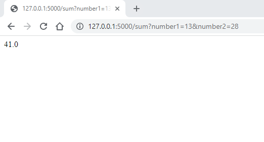
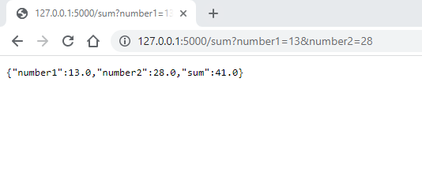
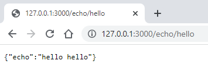

# Setting up a backend service with an interface

In this module you will learn to implement a backend in Python. This way you can build
a web service so that the HTML, CSS or JavaScript user interface (UI) communicates with the
HTTP endpoints provided by the backend written in Python.

The user of a backend does not necessarily have to be a browser. With the approach presented here,
the backend service can be used programmatically from any service with any programming language thanks to
the HTTP connection protocol.

## Flask library installation

A Python program is made into a backend service using the Flask library. Flask enables the programming
of endpoints. An external program (such as a web browser) can use those endpoints to execute operations
programmed into the backend service.

Let's look at an example where we create a backend service that receives two numbers and adds them together. 
This kind of an operation would not of course need a backend service. However, this simple example is used
just to demonstrate the required technology.

We will start by installing the Flask library. The installation can be done directly from the PyCharm IDE:

1. Select **View / Tool Windows / Python Packages**.
2. Type **Flask** into the search field. Select **Flask** from the list that opens and click **Install**

The library is now ready to use.

## Programming endpoints

Once Flask has been installed, we can write the first version of our program into a file named `sum_service.py`:

```python
from flask import Flask, request

app = Flask(__name__)
@app.route('/sum')
def sum():
    args = request.args
    number1 = float(args.get("number1"))
    number2 = float(args.get("number2"))
    sum = number1+number2
    return str(sum)

if __name__ == '__main__':
    app.run(use_reloader=True, host='127.0.0.1', port=5000)

```

Let's see how the program works by starting from the last line. The call to the `app.run` method launches the backend service.
The service is opened in IP address 127.0.0.1 which is a so-called loopback (or localhost) address that points to the IP address
of your own computer. This means that the connection to that IP address can only be established from the same computer where the
program is running. Port number 5000 tells that the backend server listens to port 5000 for communication from the same
computer.

Line `@app.route('sum')` defines a so called endpoint. It means that the function `sum` on the next line is executed when
a user of the backend sends a request to the IP address followed by the string `/sum`. This means that the function can be
called from the browser by typing `http://127.0.0.1:5000/sum` as the web address. Technically, the browser then sends an
HTTP protocol GET request that the backend service built with Flask responds to.

The request portrayed above is not yet enough to calculate the sum, as also the numbers for calculating the sum must be defined
in the request. The numbers can be passed as parameters of the GET request and then be processed using the `args.get` method of the 
`request` library.

This way the backend service could be called by writing for example the address `http://127.0.0.1:5000/sum?number1=13&number2=28` to
a browser. The first parameter that has been converted to a float "13" is assigned as the value of the `number1` variable. Respectively,
the second parameter, string "28", is converted to a float and assigned to the `number2` variable. The sum is calculated, converted into
a string and then returned as the return value of the function.

When the backend service is called from a browser the resulting number is seen on the browser window:



At this point the backend service technically works, but the format of the result is not optimal to be processed programmatically.

## Generating a JSON response

When a backend sends a response to a browser, the best format for the response is usually JSON. JSON (*JavaScript
Object Notation*) is a presentation format that complies with the structure of JavaScript objects. Luckily, the structure is also
intuitive for developers accustomed to objects in Python language.

Let's modify the `sum` function in the example so that it no longer returns a string but instead produces a response in JSON format.
This is done by using the `json` library which we will have to import by adding the corresponding `import` statement again at the 
beginning of our program:


```python
from flask import Flask, request
import json

app = Flask(__name__)
@app.route('/sum')
def sum():
    args = request.args
    number1 = float(args.get("number1"))
    number2 = float(args.get("number2"))
    sum = number1+number2

    response = {
        "number1" : number1,
        "number2" : number2,
        "sum" : sum
    }

    json_data = json.dumps(response, default=lambda o: o.__dict__, indent=4)

    return response

if __name__ == '__main__':
    app.run(use_reloader=True, host='127.0.0.1', port=5000)
```

Now the program produces a JSON response which is easy to process for example by running a JavaScript code on a browser:



The JSON presentation in the example is built based on the Python object structure and using the `json.dumps` method. The
quite cryptic-looking method call transforms the object structure into a JSON structure. The statement utilizes an anonymous
labmda function which is not discussed here.

The simple backend service presented here can be used to build a more versatile backend service with the required amount of 
endpoints.

## Parsing the request

In the previous examples, the parameter values were provided as HTTP request parameters, separated from the domain and country parts
with a question mark (`?`). This is a traditional way to send parameters in HTTP requests.

An alternative way is to specify the resource targeted by the request in the body of the web address.
The following simple example implements an "echo service" that echoes, or doubles, the string provided
by the client. In the example, the string is not given as a parameter but as a part of the actual web address.
Flask provides an easy approach for handling parts of the web address:

```python
from flask import Flask

app = Flask(__name__)
@app.route('/echo/<text>')
def echo(text):
    response = {
        "echo" : text + " " + text
    }
    return response

if __name__ == '__main__':
    app.run(use_reloader=True, host='127.0.0.1', port=3000)
```

The service looks like this when viewed via a web browser:



The developer of the backend service can freely choose how the handling of the web address part after the domain and the country code is done.
Particularly, the REST architecture style encourages the latter approach where the targeted resource is given
as part of the actual web address instead of providing it as a parameter value.
