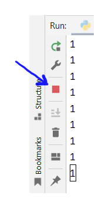

# While-toistorakenne

Seuraavaksi opit laatimaan ohjelmia, joissa sama ohjelmakoodin osa suoritetaan useampaan kertaan.
Tämän tekee mahdolliseksi toistorakenne. Toistorakenteen avulla voidaan esimerkiksi ohjelmoida jokin
toiminto tapahtuvaksi 20 kertaa peräkkäin, tai vaihtoehtoisesti voimme toistaa toimintoa niin
kauan kunnes käyttäjä antaa syötteen, jolla hän käskee lopettaa toistamisen.

Toisto on yksi ohjelmointikielten kolmesta perusperiaatteesta peräkkäisyyden ja valinnaisuuden ohella.
Kun nämä kolme perusperiaatetta ovat hallussa, pystyy ohjelmoija kirjoittamaan algoritmisen ratkaisun mihin tahansa
laskennalliseen ongelmaan.

Python-kielessä on kaksi toistorakennetta:
1. alkuehdollinen toistorakenne (while)
2. iteroiva toistorakenne (for)

Tässä moduulissa opit käyttämään alkuehdollista toistorakennetta.

## Alkuehdollinen toisto

Oletetaan, että latte maksaa kahvilassa viisi euroa, ja haluamme maksaa sen kolikoilla.
Seuraava pseudokoodi kuvaa alkuehdollisen toistorakenteen idean: niin kauan kuin taskusta kaivetut kolikot eivät riitä,
kaivetaan kolikoita yksi kerrallaan lisää:

```monospace
niin kauan kuin maksettu_rahamäärä < 5
	anna kolikko
```

Jossain vaiheessa maksettu rahasumma tulee riittävän suureksi, ja kolikoiden lisääminen voidaan lopettaa.

Toistorakenteen avulla saadaan ohjelmassa oleva lauseiden joukko toistettua useita kertoja.
Pseudokoodiesimerkissä on alkuehto, joka testataan rakenteeseen tultaessa.
Jos ehto on tosi, suoritetaan sisennetty lohko.
Aina kun sisennetty lohko on suoritettu, testataan onko alkuehto yhä voimassa. Jos on, suoritetaan sisennetty lohko uudelleen.
Toistorakenteesta päästään pois vasta, kun alkuehto on epätosi.

Pythonissa alkuehdollinen toistorakenne toteutetaan  while-lauseen avulla.

```monospace
while (ehto):
	toistettava lohko
```

Kuten if-ehtolauseessa, ehto on lauseke, jonka totuusarvo voidaan laskea. Ehto on siis joko tosi tai epätosi.

1. Jos ehto on tosi, sisennetty lohko (eli sisennetyt lauseet) suoritetaan.
2. Jos ehto on epätosi, sisennettyä lohkoa ei suoriteta.

Ainoa ero if-lauseeseen on se, että ehdon arvo lasketaan uudelleen aina sisennetyn lohkon suorituksen jälkeen.
Jos ehto on edelleen tosi, suoritetaan sisennetty lohko uudelleen.
Tämän jälkeen testataan jälleen ehdon voimassaolo - aina ennen uutta kierrosta.

## Esimerkki 1: kiinteä määrä toistokertoja

Kirjoitetaan ohjelma, joka kysyy käyttäjältä, montako kertaa tervehditään. Tämän jälkeen
tulostetaan tervehdykset:

```python
kerrat = int(input("Montako kertaa tervehditään: "))
tehdyt = 0
while tehdyt<kerrat:
    print("Hyvää huomenta")
    tehdyt = tehdyt + 1
```

```monospace
Käyttäjän syöte määrää toistojen lukumääärän:
Montako kertaa tervehditään: 5
Hyvää huomenta
Hyvää huomenta
Hyvää huomenta
Hyvää huomenta
Hyvää huomenta
```

Tässä esimerkissä on kaksi muuttujaa:
1. tehdyt-nimisen muuttujan arvona on toistojen kokonaismäärä. Kun se on luettu käyttäjältä, arvo pysyy muuttumattomana koko
ohjelman suorituksen ajan.
2. kerrat-niminen muuttuja on kierrosmuuttuja. Se alustetaan nollaksi. Jokaisen kierroksen päättyessä kierrosmuuttujan arvoa
kasvatetaan yhdellä.

Oletetaan, että käyttäjä pyytää viisi tervehdystä. Arvo 5 tallentuu kerrat-muuttujan arvoksi.
Kun while-toistorakenteeseen tullaan ensimmäisen kerran, tehdyt-muuttuja on alustettu nollaksi. While-toistorakenteen
alkuehto on nyt 0<5 eli tosi. Suoritus etenee while-toistorakenteen sisälle. Siellä tulostetaan ensimmäinen tervehdys,
ja tehdyt-kierrosmuuttujan arvoa kasvatetaan nollasta yhteen.

Koska kyseessä oli while-rakenne, alkuehto testataan nyt uudelleen. Ehto on nyt 1<5 eli edelleen tosi. While-toistorakenteen
sisällä tulostetaan toinen tervehdys ja kasvatetaan tehdyt-muuttujan arvoa yhdellä. Uudeksi arvoksi tulee 2.

Näin toistokierrokset jatkuvat. Viidennnen tervehdyksen tulostamisen päätteeksi tehdyt-muuttujan arvoksi tulee 5. Jälleen testataan
while-toistorakenteen alukehto. Tällä kertaa se on 5<5, joka on epätosi. Seuraavaa toistokierrosta ei tule, ja ohjelman suoritus jatkuisi
while-toistorakenteen jälkeisestä lauseesta. Sellaista ei ohjelmassa ole, joten suoritus päättyy.


## Esimerkki 2: käyttäjä lopettaa toiston

Seuraavassa ohjelmassa toistokierrosten lukumäärä ei ole tiedossa toistorakenteeseen tultaessa.
Ohjelma kysyy käyttäjältä tekstimuotoisia komentoja siihen saakka, kunnes käyttäjä antaa lopeta-komennon:

```python
komento = input ("Anna komento: ")
while komento!="lopeta":
    print ("Suoritan toiminnon: " + komento)
    komento = input("Anna komento: ")
print ("Toiminnot lopetettu.")
```

Suorituskertojen määrä riippuu käyttäjän syötteestä:

```monospace
Anna komento: laula
Suoritan toiminnon: laula
Anna komento: tanssi
Suoritan toiminnon: tanssi
Anna komento: lopeta
Toiminnot lopetettu.
```

Esimerkissä hyödynnetään Python-kielen mukana tulevaa random-kirjastoa.
Kirjasto otetaan käyttöön kirjoittamalla ohjelman alkuun sitä vastaava import-lause.
Valmiiden kirjastojen käyttöä ei tarvitse opetella ulkoa, vaan käyttötavan
voi aina tarkistaa dokumentaatiosta: [https://docs.python.org/]

## Esimerkki 3: vaihteleva määrä toistoja

Tarkastellaan seuraavaksi simulaatioesimerkkiä, jossa toistokertojen lukumäärä riippuu satunnaislukugeneraattorista.
Ohjelma heittelee kahta noppaa niin kauan, kunnes saadaan kaksi kuutosta.

Tarvittavien heittojen lukumäärä vaihtelee suorituskerrasta toiseen:

```python
import random
noppa1 = noppa2 = heitot = 0
while (noppa1!=6 or noppa2!=6):
    noppa1 = random.randint(1,6)
    noppa2 = random.randint(1,6)
    heitot = heitot + 1
print(f"Tarvittiin {heitot:d} heittoa.")
```

```monospace
Tarvittiin 17 heittoa.
```

```monospace
Tarvittiin 37 heittoa.
```


## Sisäkkäiset toistorakenteet

Toistorakenteita voidaan asettaa sisäkkäin siten, että kutakin ulomman toistorakenteen kierrosta kohden suoritetaan sisempi
toistorakenne kokonaisuudessaan.

Tulostetaan kertotaulu yhdestä viiteen. Mukaan otetaan siis kaikki 25 erilaista tuloa, joissa tulon tekijät
ovat 1, 2, 3, 4 tai 5:

```python
eka = 1
while eka <= 5:
    toka = 1
    while toka <= 5:
        print(f"{eka} kertaa {toka} on {eka*toka:d}")
        toka = toka + 1
    eka = eka + 1
```

```monospace
1 kertaa 1 on 1
1 kertaa 2 on 2
1 kertaa 3 on 3
1 kertaa 4 on 4
1 kertaa 5 on 5
2 kertaa 1 on 2
2 kertaa 2 on 4
...
5 kertaa 3 on 15
5 kertaa 4 on 20
5 kertaa 5 on 25
```

Laajennetaan edellistä kahden nopan heittämisesimerkkiä siten, että ohjelma tulostaa, montako heittokertaa tarvitaan *keskimäärin* ennen
kuin saadaan kaksi kuutosta.

Keskiarvon laskemiseksi asetetaan simuloitavien heittosarjojen lukumäärä hyvin suureksi, sataantuhanteen:

```python
import random
toistot = 0
heitot_yhteensä = 0
while toistot < 100000:

    noppa1 = noppa2 = heitot = 0
    while (noppa1!=6 or noppa2!=6):
        noppa1 = random.randint(1,6)
        noppa2 = random.randint(1,6)
        heitot = heitot + 1
    #print(f"Tarvittiin {heitot:d} heittoa.")
    toistot = toistot + 1
    heitot_yhteensä = heitot_yhteensä + heitot

heitot_keskimäärin = heitot_yhteensä/toistot
print(f"Heitot keskimäärin: {heitot_keskimäärin:6.2f}")
```

Heittokierroskohtiasen tulostuslauseen eteen on lisätty kommenttimerkki, jotta konsoli ei täyty sadastatuhannesta tulosteesta.

Tulosteesta nähdään keskimääräinen vaadittujen heittojen lukumäärä. Vaikka toistoja on paljon, satunnaisvaihtelu
vaikuttaa hieman tulokseen:

Heitot keskimäärin:  35.86

Nähdään, että heittoja tarvitaan keskimäärin 36 kappaletta. Tämä vastaa laskemalla saatavaa tulosta. Teimme juuri
empiirisen simulaation, jossa arvio teoreettisesta tuloksesta saadaan jäljittelemällä ilmiötä tietokoneella.


## Break

Python-kielessä on break-lause, jonka avulla on mahdollista poistua toistorakenteesta välittömästi.
Tällöin toistoehdon arvoa ei enää lasketa.

Seuraavassa esimerkissä MAYDAY-komennolla poistutaan toistorakenteen sisältä kokonaan ja saman tien:

```python
komento = input ("Anna komento: ")
while komento!="lopeta":
    if komento=="MAYDAY":
        break
    print ("Suoritan toiminnon: " + komento)
    komento = input("Anna komento: ")
print ("Toiminnot lopetettu.")
```

Kun käyttäjä on antanut MAYDAY-komennon, sallii while-toistorakenteen alkuehto uuden toistokierroksen aloittamisen.
While-lohkon sisällä olevan if-lauseen suorituksen seurauksena toistorakenteesta poistutaan välittömästi:

```monospace
Anna komento: laula
Suoritan toiminnon: laula
Anna komento: tanssi
Suoritan toiminnon: tanssi
Anna komento: MAYDAY
Toiminnot lopetettu.
```

Break-lauseen käytön suhteen kannattaa olla varovainen. Sen avulla voidaan kirjoittaa vaikeasti hahmotettavaa
ohjelmakoodia, ns. spagettikoodia.
Toistoehto kannattaa lähtökohtaisesti  rakentaa siten, että break-lausetta ei tarvita.

Helppolukuisen ja logiikaltaan selkeän ohjelman kirjoittaminen on osa ohjelmoijan ammattitaitoa. Niinpä break-lauseen
käyttö kannattaa rajata tilanteisiin, joissa käyttö edistää näitä tavoitteita.

## While/else

Python-kielessä while-rakenteeseen voidaan liittää else-haara, johon suoritus siirtyy, kun toistoehto on epätosi.
Else-haara suoritetaan siis toistorakenteen onnistuneen suorituksen päätteeksi. Sitä ei suoriteta, jos
toistorakenteesta poistutaan break-lauseella.

Tarkastellaan seuraavaa ohjelmaesimerkkiä:

```python
komento = input ("Anna komento: ")
while komento!="lopeta":
    if komento=="MAYDAY":
        break
    print ("Suoritan toiminnon: " + komento)
    komento = input("Anna komento: ")
else:
    print ("Näkemiin.")
print ("Toiminnot lopetettu.")
```

Ohjelma tulostaa Näkemiin-tekstin yhden kerran silloin, kun toistorakenteesta poistutaan normaalisti
alkuehdon tullessa epätodeksi:

```monospace
Anna komento: tanssi
Suoritan toiminnon: tanssi
Anna komento: lopeta
Näkemiin.
Toiminnot lopetettu.
```

Kun ohjelmasta poistutaan break-lauseella, tekstiä ei tulosteta:

```monospace
Anna komento: tanssi
Suoritan toiminnon: tanssi
Anna komento: MAYDAY
Toiminnot lopetettu.
```

Kyseessä on varsin harvoin käytetty kielen piirre.

## Ikuinen silmukka

Lopuksi tarkastellaan ikuista silmukkaa, ohjelmointivirhettä, jonka jokainen ohjelmoija silloin tällöin tekee.
Ohjelma joutuu ikuiseen silmukkaan silloin, kun toistorakenteen alkuehto ei muutu koskaan epätodeksi.
Tällainen tilanne syntyy esimerkiksi silloin, jos kierrosmuuttujan arvoa unohdetaan kasvattaa
toistorakenteen sisällä.

Seuraava virheellinen ohjelmakoodi tuottaa ikuisen silmukan:

```python
# Virheellinen ohjelma, ikuinen silmukka

luku = 1
while luku<5:
    print (luku)

# Tänne ei koskaan päästä:
print("Valmista tuli.")
```

Suoritus ei pääty koskaan:
```monospace
1
1
1
...
```

Ikuiseen silmukkaan joutunut ohjelma on pysäytettävä väkisin. PyCharm-kehittimessä se tehdään napsauttamalla
konsoli-ikkunan laidassa olevaa pysäytyspainiketta:



Jos pysäytyspainike ei pysäytä suoritusta, tarkista, että päätetoimintojen emulointi on käytössä konsoli-ikkunassa:
valitse Run/Edit Configurations, ja aseta päälle Emulate Terminal in Output Console -valintaruutu.
